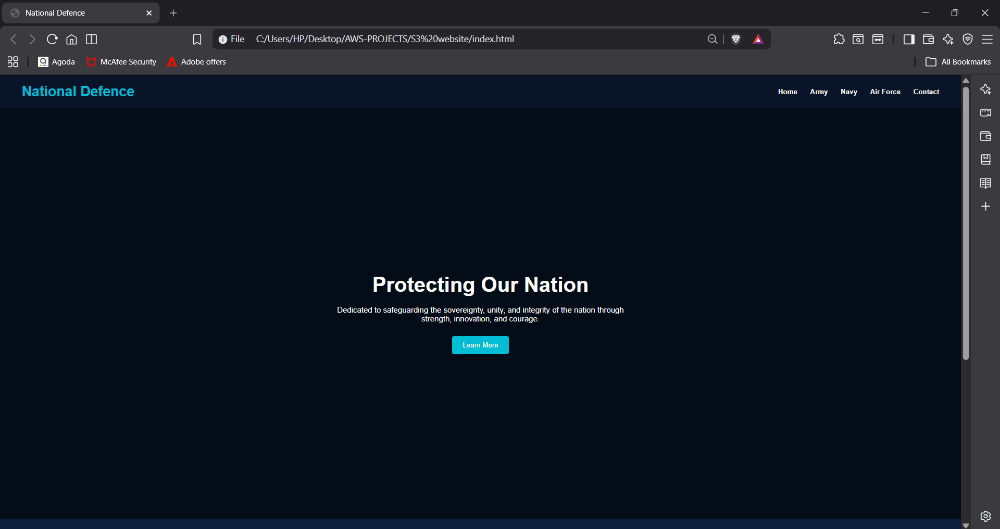
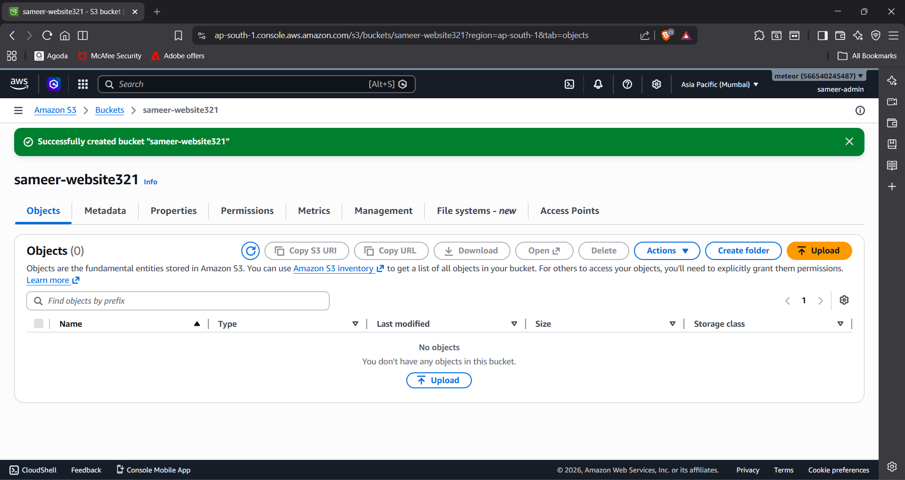
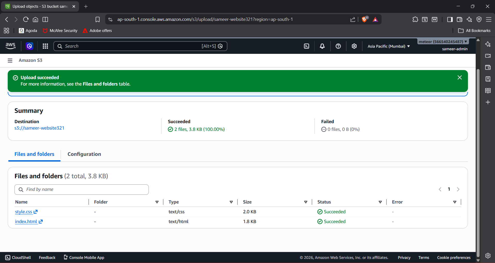
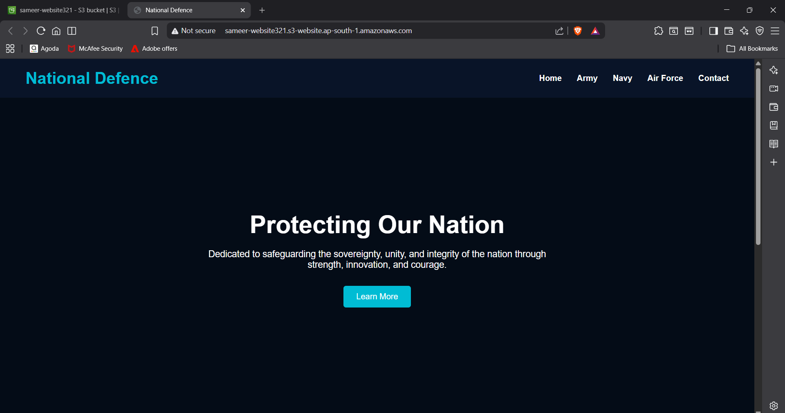

AWS S3 Static Website Hosting

Project Overview

This project demonstrates how to host a static website using Amazon S3 Static Website Hosting.

The website was created using HTML and CSS and deployed on AWS S3 with public access configuration and bucket policies.

Architecture

User Browser
↓

AWS S3 Bucket
↓

Static Website Hosting
↓

Live Website

AWS Services Used

- Amazon S3
- AWS IAM
- S3 Bucket Policies
- Static Website Hosting

Project Files

- index.html
- style.css

Deployment Steps

1. Created Website Files

Created:

- index.html
- style.css

2. Created S3 Bucket

Configured:

- Unique Bucket Name
- Mumbai Region (ap-south-1)

3. Uploaded Website Files

Uploaded:

- index.html
- style.css

4. Enabled Static Website Hosting

Configured:

- Index Document: index.html
- Error Document: index.html

5. Configured Bucket Policy

Allowed public read access using S3 bucket policy.

6. Verified Website Access

Successfully accessed the website through the S3 Website Endpoint.

Screenshots

Index HTML Code

### Index HTML Code

S3 Bucket Creation

### S3 Bucket Creation

Website Files Uploaded

### Website Files Uploaded

Static Website Hosting Enabled

### Static Website Hosting Enabled

Live Website Output

### Live Website Output

Skills Learned

- Amazon S3
- Static Website Hosting
- Bucket Policies
- IAM Fundamentals
- Cloud Security Basics

Author

Sameer Singh
